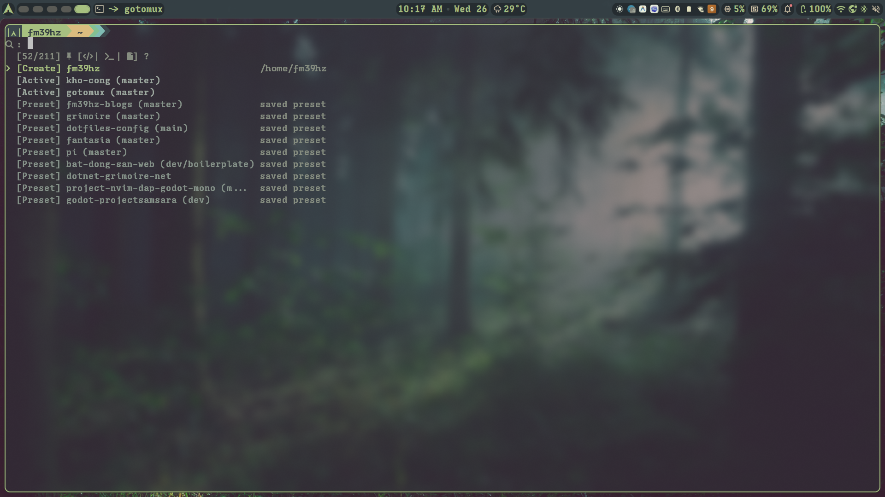

# gotomux

[](https://github.com/fm39hz/gotomux/actions)
[](https://github.com/fm39hz/gotomux/releases)
[](https://aur.archlinux.org/packages/gotomux)
[](go.mod)
[](LICENSE)

**go to mux**, a fuzzy tmux session manager with presets, sticky shapes, and adaptive ranking.

One keystroke opens a unified fuzzy picker across all your workspaces:

- **Live sessions**: Real-time listing with active process and window counts
- **Saved presets**: Snapshot whole sessions (paths, layout, and commands) with `Ctrl+F`
- **Sticky shapes**: Re-bake your favorite window/pane cockpit topology into new projects via Create or Zoxide
- **Zoxide integration**: Jump and initialize sessions instantly from your directory history
- **Adaptive self-ranking**: Automatically learns co-occurrence and directed transitions between sessions from native tmux attach events

> Single static Go binary. No cloud accounts, no network telemetry. All ranking metrics are stored in a local SQLite database.

---

## Highlights



- ⚡ **Instant Response**: Hot-path queries run in RAM via a background daemon (~1.2ms IPC round-trip, 0 disk/tmux I/O on pick) with an automatic standalone fallback (~5ms cold).
- 🧩 **Topology & Shapes**: Captures the *essence* of your workspace (window roles, splits, tool intents) without hardcoding absolute paths.
- 🧠 **Smart Ranking**: Ranks candidates using frecency, pairwise session co-occurrence, and directed switch sequences.
- 🔄 **Baseline Recovery (`-r`)**: Restore altered sessions to their initial layout state without killing running processes.

---

## Installation

**Prerequisites:** `tmux` (required), `zoxide` (optional), Nerd Font (optional, or set `icons = "ascii"`).

### Arch Linux (AUR)

```bash
paru -S gotomux

# Optional: enable background daemon for instant pre-warmed picker
systemctl --user enable --now gotomuxd
```

### Go Install (Any platform)

```bash
go install github.com/fm39hz/gotomux@latest
go install github.com/fm39hz/gotomux/cmd/gotomuxd@latest
```

### Build from Source

```bash
git clone https://github.com/fm39hz/gotomux.git && cd gotomux
make install           # CLI only
make install-all       # CLI + daemon + systemd user service
```

---

## Shell & Tmux Setup

### Tmux Popup (Recommended)

`gotomux` works seamlessly as a floating popup inside tmux:

```tmux
# ~/.tmux.conf
bind-key C-b display-popup -T " Go to mux " -w 80% -h 70% -x C -y C -E "gotomux"
bind-key C-e display-popup -T " Edit config " -w 80% -h 90% -x C -y C -E "gotomux -e"
bind-key C-r run-shell "tmux display-message \"$(gotomux -r)\""
bind-key -n C-f run-shell "tmux display-message \"$(gotomux -f)\""
```

### Shell Keybindings

**Nushell**

```nu
$env.config.keybindings ++= [{
  name: launch_gotomux
  modifier: control
  keycode: char_b
  mode: [emacs, vi_normal, vi_insert]
  event: { send: executehostcommand, cmd: "gotomux" }
}]
```

**Fish**

```fish
function fish_user_key_bindings
    for mode in insert default visual
        bind -M $mode \cb 'gotomux; commandline -f repaint'
    end
end
```

---

## Usage

```text
Usage: gotomux [flags]

Flags:
  -h, --help     Show this help
  -v, --version  Show version
  -f, --freeze   Freeze current or named session as a preset
  -e, --edit     Edit a named preset (or freeze-then-edit)
  -r, --reset    Restore current or named session to its baseline layout
  -p, --profile  Profile cold-start performance
```

### Keybindings

| Key | Action |
| :--- | :--- |
| `Enter` | Connect / Attach / Create session |
| `Ctrl + N` / `Ctrl + P` | Next / Previous item |
| `Ctrl + U` / `Ctrl + W` | Clear query / Delete word backward |
| `Ctrl + F` | Freeze current session into preset + shape |
| `Ctrl + T` | Set sticky shape for newly created sessions |
| `Ctrl + E` | Edit preset |
| `Ctrl + D` | Kill an active session / delete a preset |
| `Esc` / `Ctrl + C` | Cancel & Exit |
| `?` | Toggle help view |

### Item Actions on `Enter`

| Source Item | Behavior |
| :--- | :--- |
| **Active** | Attach or switch directly to the live session |
| **Preset** | Load preset topology and commands if not running, then attach |
| **Create / Zoxide** | Live? Attach · Preset exists? Load · Otherwise: bake **sticky shape** into project root |

---

## Core Concepts

### Shapes & Presets

- **Preset**: A concrete session snapshot including specific working directories and running commands.
- **Shape**: The abstract *topology* of your workspace (e.g. editor window with `nvim` + split terminal + `yazi` file manager).

Sticky shapes are automatically baked when launching new sessions from project roots or Zoxide paths:

```json
{
  "id": "shape-2942bbbd21e65a14",
  "label": "nvim+v2+yazi",
  "windows": [
    { "fork": "1||nvim", "name": "editor", "panes": [{ "cmd": "nvim" }] },
    {
      "fork": "2|even-vertical|",
      "name": "shell",
      "split": "even-vertical",
      "panes": [{}, {}]
    },
    { "fork": "1||yazi", "name": "files", "panes": [{ "cmd": "yazi" }] }
  ]
}
```

Shapes are automatically mirrored as editable JSON in `$XDG_CONFIG_HOME/gotomux/shapes/<label>--<id8>.json`.

### Baseline Reset (`gotomux -r`)

Restores the current or target session back to its recorded baseline layout:
- Recreates closed panes and dead windows in their original layout positions with their starting commands.
- Existing processes in surviving windows are untouched.
- Extra windows added on the fly are preserved.

### Ranking Model

Gotomux organizes sessions in a space × time matrix:

| | Current Directory | Anywhere |
| :--- | :--- | :--- |
| **Future** | **Create** | **Zoxide** |
| **Present** | — | **Active** |
| **Past** | — | **Preset** |

Ranking sort order: `tier > recency > cooccur > trans > kind > detail > busy > pathQ > idx`.

Inside tmux, the current session is filtered out and learned transition probabilities (switch history) and co-occurrence scores surface your next likely session to the top.

---

## Configuration

Settings are configured via TOML at `$XDG_CONFIG_HOME/gotomux/config.toml`:

```toml
# gotomux configuration
data_dir        = ""     # base for state.db + socket   ($XDG_DATA_HOME/gotomux)
config_dir      = ""     # base for shapes/ + config    ($XDG_CONFIG_HOME/gotomux)

poll_interval   = "10s"  # daemon sync cadence
zoxide_cap      = 40     # max zoxide rows when query is empty
max_show        = 12     # visible picker rows
git_concurrency = 4      # git branch enrich workers
proc_cache_ttl  = "2s"   # pane process detection cache
prune_cutoff    = "720h" # stale telemetry prune threshold

icons           = "auto" # auto | nerd | ascii

[daemon]
autostart = true         # auto-spawn daemon if absent
prewarm   = "auto"       # page-cache prewarm: auto | on | off
```

### File Locations

| Path | Description |
| :--- | :--- |
| `$XDG_CONFIG_HOME/gotomux/shapes/*.json` | Mirrored shape definitions |
| `$XDG_CONFIG_HOME/gotomux/config.toml` | User configuration |
| `$XDG_DATA_HOME/gotomux/state.db` | SQLite state (presets, shapes, usage, ranking) |
| `$XDG_DATA_HOME/gotomux/gotomux.sock` | Daemon IPC socket |

---

## Development

```bash
make build       # build gotomux binary
make build-all   # build gotomux + gotomuxd
make test        # run tests (add -short for CI style)
make fmt vet     # format and check code
make pkg         # build Arch package
```

### Roadmap

- [x] Multi-source picker: Create / Tmux / Preset / Zoxide
- [x] Session Freeze / Load, Sticky shapes & Fork learning
- [x] Config reconcile & JSON shape export
- [x] Arch Linux AUR packaging & automated semantic release
- [ ] Remote tmux session integration (`tmux@host`)

---

## Built With

- [Bubble Tea](https://github.com/charmbracelet/bubbletea) & [Lip Gloss](https://github.com/charmbracelet/lipgloss): TUI framework and styling
- [fzf](https://github.com/junegunn/fzf): Fuzzy matching core algorithm
- [modernc.org/sqlite](https://gitlab.com/cznic/sqlite): Pure Go SQLite engine
- [projectdetect](https://github.com/richardwooding/projectdetect): Project root marker detection
- [go-devicons](https://github.com/epilande/go-devicons): Nerd font devicons
- [gopsutil](https://github.com/shirou/gopsutil): Process detection for freezing sessions

---

## Acknowledgements

Gotomux started as a bash script gluing together several CLI tools before being rewritten into a standalone Go tool. Special thanks to the projects and tools that inspired and powered that original workflow:

- [sesh](https://github.com/joshmedeski/sesh): Smart tmux session manager inspiration
- [fzf](https://github.com/junegunn/fzf): Interactive fuzzy search & keybindings
- [tmuxp](https://github.com/tmux-python/tmuxp): Session freezing & layout persistence inspiration
- [zoxide](https://github.com/ajeetdsouza/zoxide): Smarter directory jumping as a session source
- [fd](https://github.com/sharkdp/fd): Fast filesystem traversal for preset discovery
- [tmux](https://github.com/tmux/tmux): The terminal multiplexer itself

---

## License

[MIT](LICENSE)
